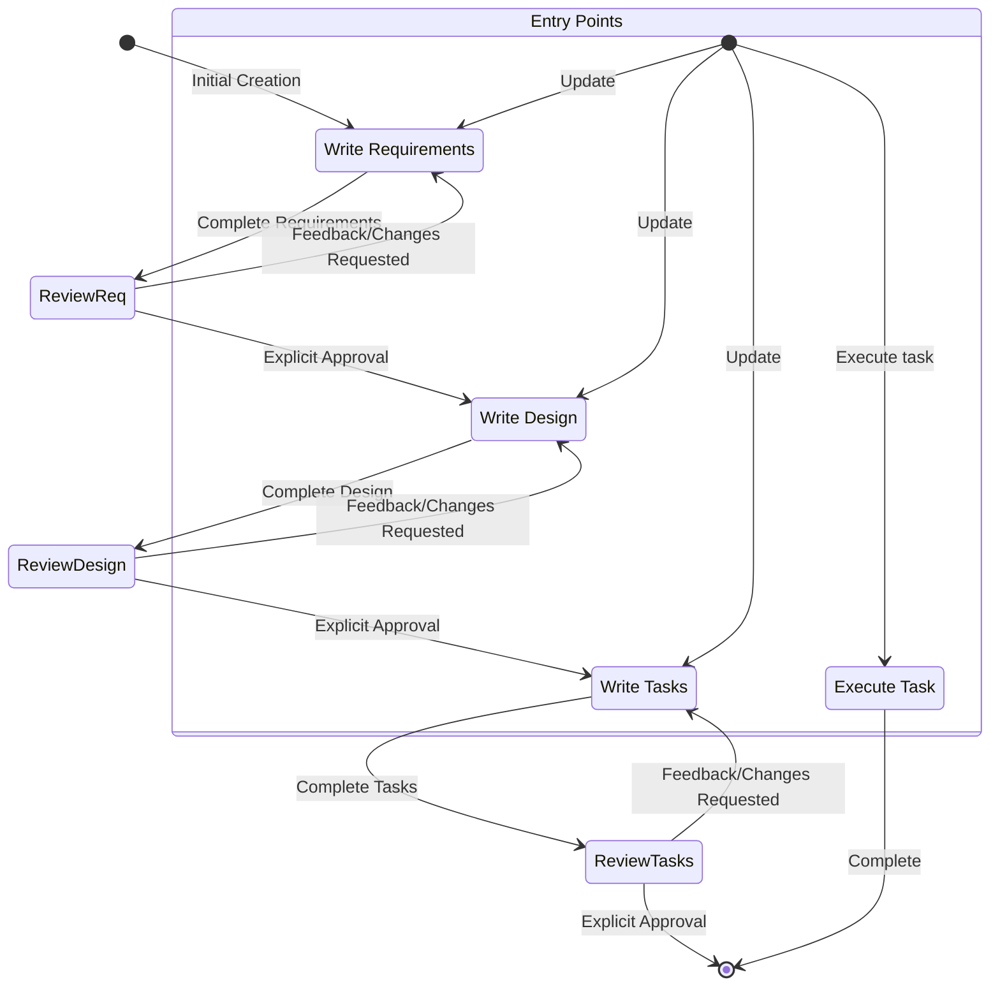
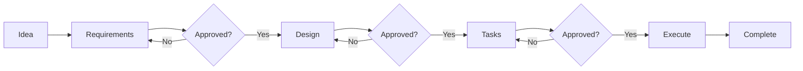
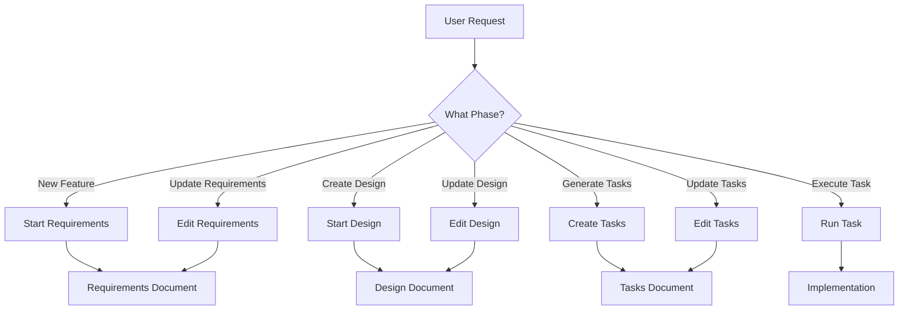
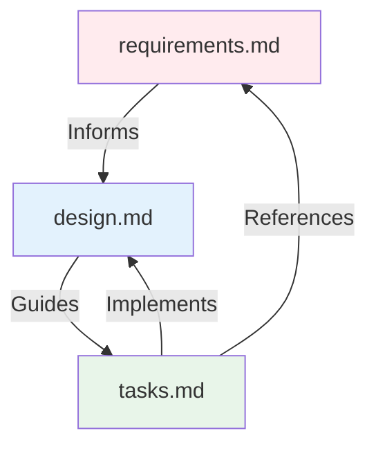
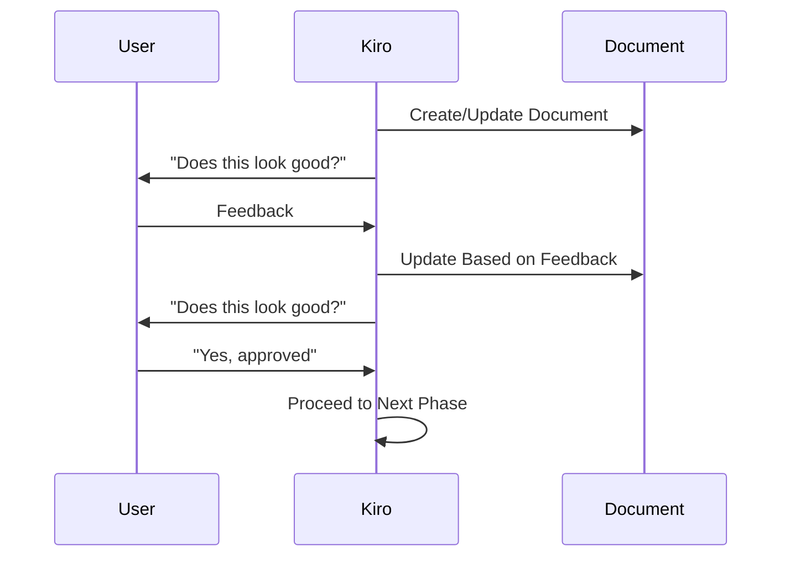
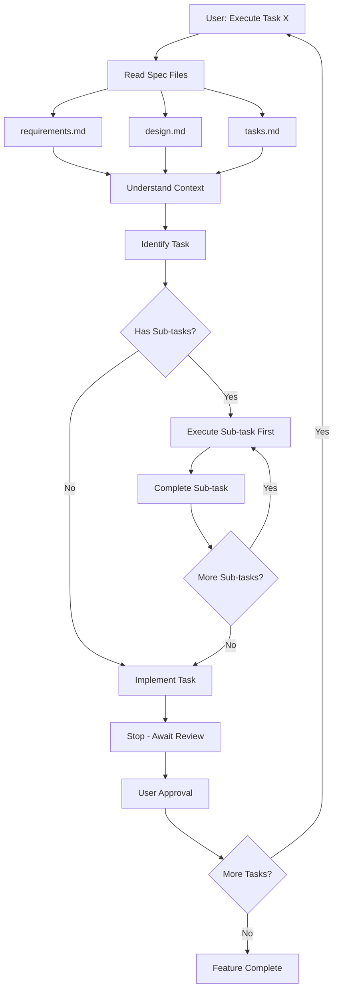

# Kiro Workflow Diagrams

## Main Workflow State Machine

This diagram shows the complete workflow from initial creation through task execution:



## Phase Progression

This simplified diagram shows the linear progression through phases:



## Workflow Entry Points

Users can enter the workflow at different points:



## File Structure

```
.kiro/
└── specs/
    └── {feature-name}/    # kebab-case
        ├── requirements.md  # Phase 1
        ├── design.md        # Phase 2
        └── tasks.md         # Phase 3
```

## Document Dependencies



## Approval Gates

Each phase has an explicit approval gate:



## Task Execution Flow


